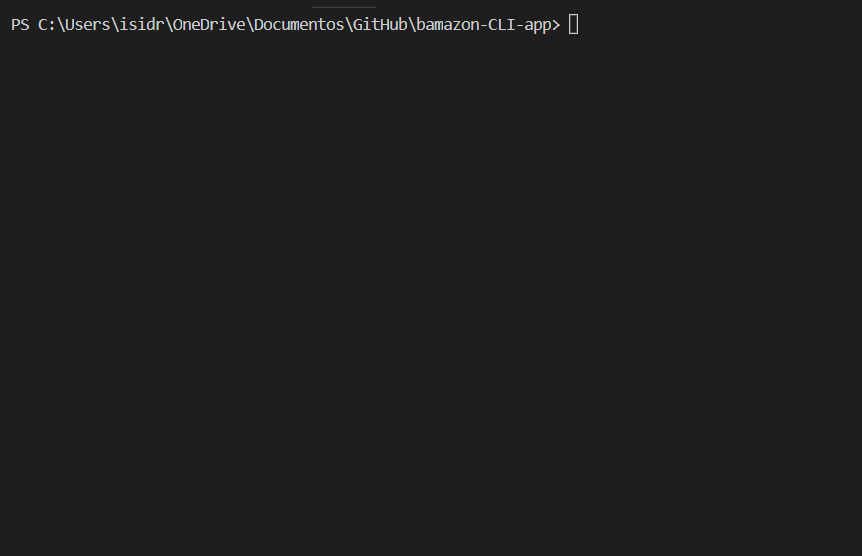
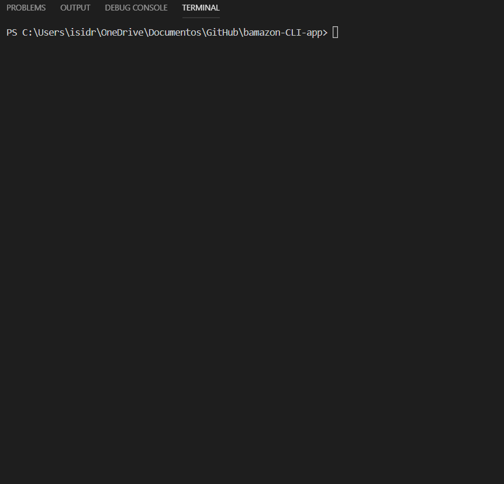

# bamazon-CLI-app
### Storefront using MySQL to take in orders from customers and deplete stock from the store's inventory, 

1. Uses MySQL database called `bamazon`
   
2. The database contains : a table called `products` with this columns:

    - item_id (Primary Key)
    - product_name
    - department_name
    - price
    - stock_quantity.
  
2. A table called `departments` with this columns:

    - department_id (Primary Key)
    - department_name

## Installs

The package.json lists dependent node packages. You must to run "npm init" in your terminal. This will instal third party npm packages.

## Environment

1. To use `bamazon` you have to install.

#### MySQL
   - Go to [MySQL_for_Windows](https://dev.mysql.com/downloads/installer).
   - Download MySQL’s installer.
   - Set your root password.
   
#### MySQL Workbench
   - Go to the [MySQL_Workbench](https://dev.mysql.com/downloads/workbench) website.
   - Select the 64-bit Windows version of the software.
   - Download and run the installer.

#### MAMP
   - Go to the [MAMP_website](https://www.mamp.info/en/downloads/)
   - Select the download for Windows.
   - Follow the prompts to complete the installation. 

## Get Started

1. Main Menu, select 1 listed option:
   - "View Products for Sale" to buy a product,
   - "View Low Inventory" for get information about a the products with low inventory (less than 5 units),
   - "Add to Inventory" increments the actual qty of a product,
   - "Add New Product" add a new product to the table,
   -  "exit".

To perform a buy, select the "View Products for sale" option, enter the item id of the product and the amount that you want to buy, then the app display de total purchase and updates the qty in the products table.

2. Supervisor Menu, select 1 listed option:
   - "View Product Sales by Department" to get a summary of sales by department,
   - "View Sales by Product" to get a summary of sales by product,
   - "Create New Department" inserts into the departments table a new one,
   -  "exit".
   
      - View Product Sales by Department displays the sales group by department id,
      - View Sales by Product displays the sales group by product id,
      - Create New Department insert into departments table a new department.
  

## Technologies used to build the app

   - [Node.js,](https://nodejs.org/en/)
   - [Javascript,](https://www.w3schools.com/js/default.asp)
   - Node Packages :
     - MySQL
     - chalk,
     - console.table,
     - inquirer.

## Future code development

Build a complete RDBMS for the management of the business including tables like :
   - Human Reources,
   - Supliers,
   - Customers.

## Author

[Isidro Quevedo](https://iquevedom.github.io/My_Bio/)

